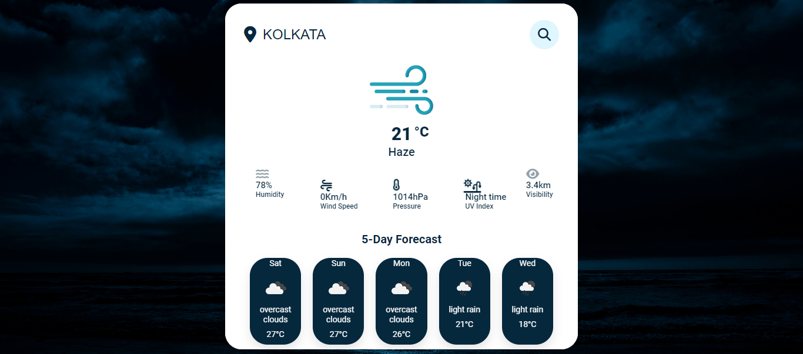
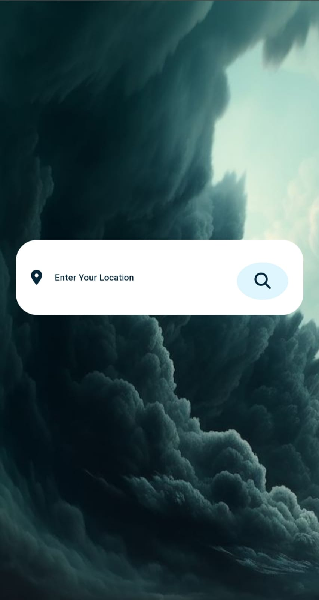
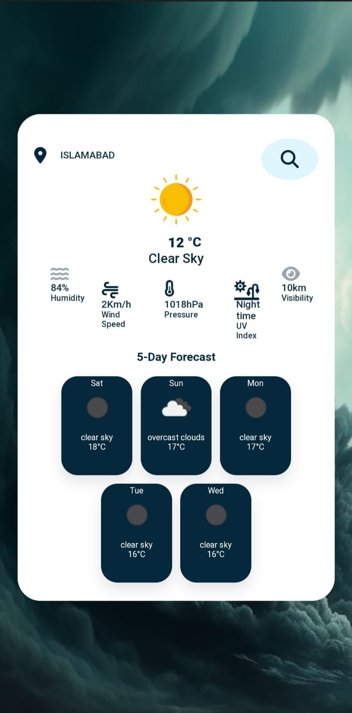

# Weather Web App-

### Project Description:
Our team has developed a Weather Web Application as part of our minor project.

## Key Technologies Used:
HTML: Responsible for the structural layout and organization of elements.

CSS: Utilized for aesthetic styling and ensuring a user-friendly interface.

JavaScript: Empowered the application with dynamic functionality for real-time updates and interactive features.

Additional Technologies: Integrated complementary technologies or APIs for enhanced capabilities, like backend services for data processing or frameworks improving user experiences

### Objectives and Features:

Real-time Weather Updates: Providing accurate and up-to-date weather information.

User-Friendly Design: Ensuring an intuitive interface for seamless navigation and interaction.

Dynamic Functionality: Incorporating interactive elements and dynamic features for an enriched user experience.

### Objectives and Features:

Through collaborative efforts utilizing HTML, CSS, JavaScript, and other relevant technologies, our team successfully created a functional and engaging Weather Web Application for our minor project.

# Conclusion:
Through collaborative efforts utilizing HTML, CSS, JavaScript, and other relevant technologies, our team successfully created a functional and engaging Weather Web Application for our minor project.

# Screenshots:

